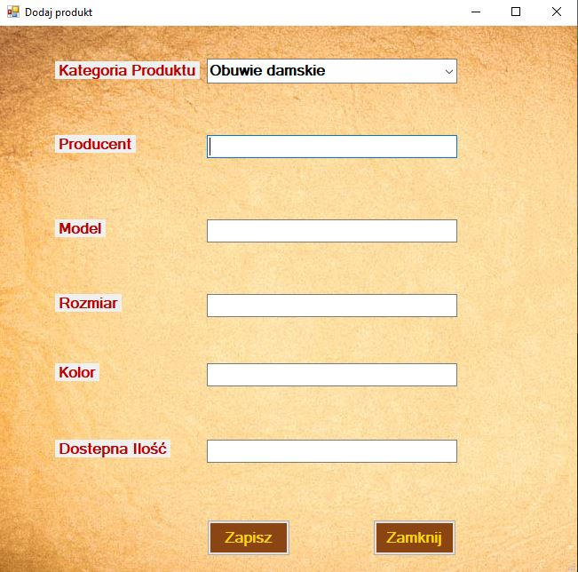
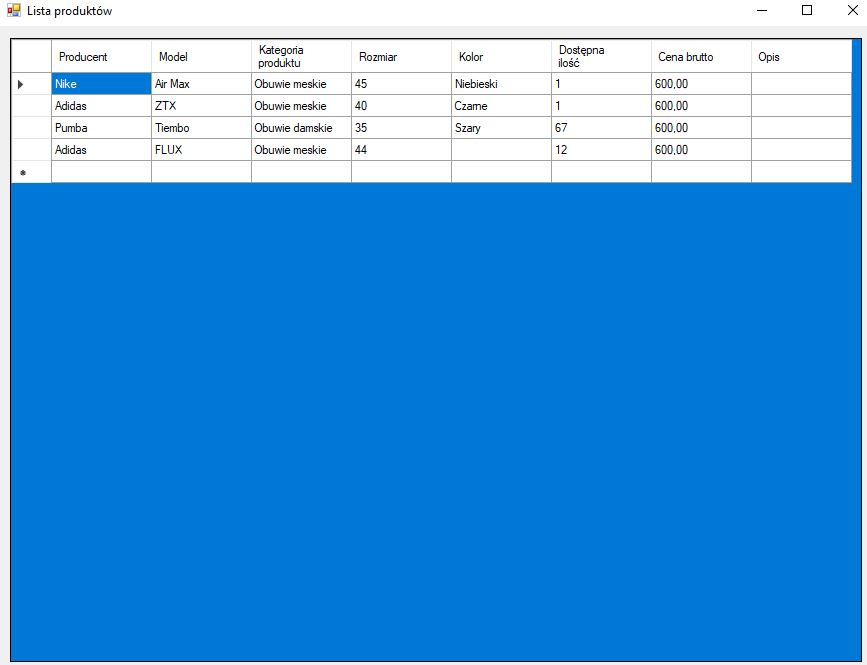
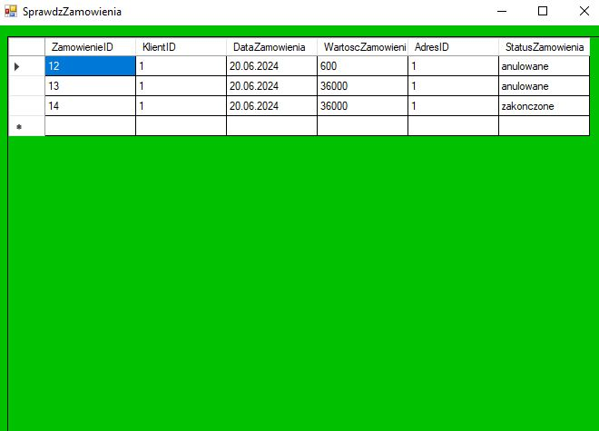
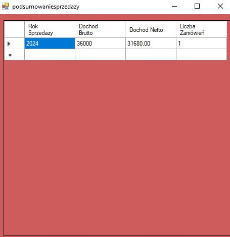

# Moje reporytorium
Projekt zawiera aplikacje GUI do obsługi bazy danych sklepu internetowego

# Główne okno aplikacji

Okno aplikacji umożliwia:
- dodanie nowych produktów do bazy danych,
- dodanie ceny do produktów w danym modelu, w danej kategorii produktu,
- dodanie klientów do bazy danych,
- wyświetlanie listy klientów oraz ich danych
- wyświetlanie listy produktów
- wyświetlanie zamówien
- widok podsumowania sprzedaży w danym roku (dochód netto, dochód brutto, liczba zamówien 'Zakończonych")

# Okno dodawania produktów do sklepu

Okno Dodaj produkt umożliwia dodawanie produktów do bazy danych sklepu w wyznaczonych kategoriach produktu z listy rozwijanej. 
Po wyborze kategorii produktu można dodać następujące informacje:
- producent,
- model,
- rozmiar,
- kolor,
- dostępna ilość.
Procedura, która obsługuje okno zezwala na wartości null'owe dla niektórych parametrów wejściowych. Dodatkowo istnieje trigger, który korzysta z tabeli walidacyjnej i uzależnia rozmiar od wybranej kategorii produktu
np. nie mozna dodać rozmiaru 45 do obuwia w kategorii damskiej.
W przypadku, kiedy produkt istnieje już w bazie danych i ma on określoną dostępną ilość to procedura sumuję aktualna i nowo-dodaną ilość produktów - zwiększając zatem dostępną do zamówienia ilośc (stan magazynowy).

# Okno dodawania/aktualizowania ceny do wybranych produktów

Okno Dodaj cenę umożliwia dodanie/aktualizowanie (jeśli istnieje) ceny netto wybranego modelu produktu z listy rozwijanej w wybranej kategorii.

# Okno dodawania klientów

Okno Dodajklientów umożliwia ręczne dodanie klienta do bazy danych sklepu. 
Zastosowane rozwiązania nie zezwalają na duplikaty loginu i emaila. Dodatkowo blokowane jest dodawanie kodu pocztowego w innym formacie niż xx-xxx.

# Okno do wyświetlania klientów

Okno Lista klientów umożliwia wyświetlanie listy klientów sklepu wraz z ich pełnymi danymi.

# Okno do wyświetlania produktów

Okno Lista produktów umożliwia wyświetlanie listy produktów sklepu wraz z danymi dotyczącymi koloru, modelu, producenta...

# Okno do wyświetlania zamówien

Okno Sprawdz zamowienia umożliwia przegląd zamówien złozonych w sklepie.

# Okno podsumowania sprzedaży

Okno Podsumowanie sprzedaży służy do szybkiego podsumowania dochodu netto i brutto oraz w liczby zrealizowanych zamówien w danym roku.
